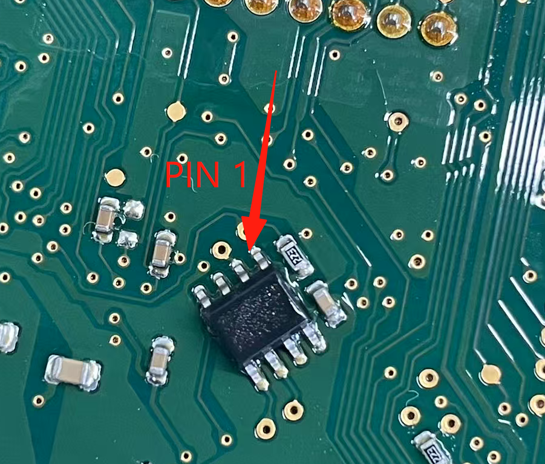
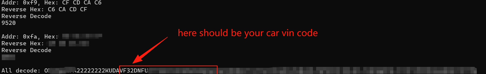
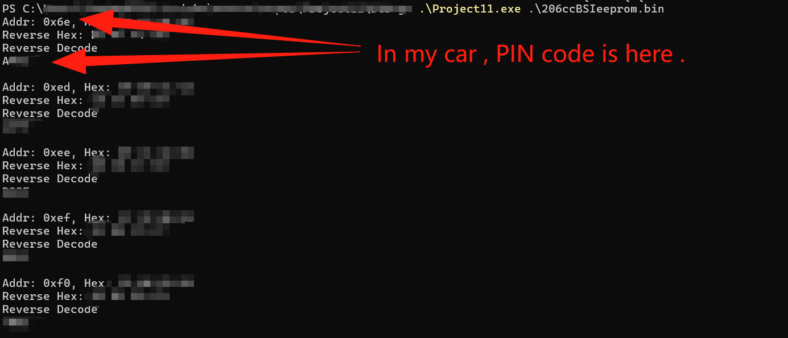

# Peugeot206ccPinCodeDecoder
Self use Peugeot 206cc BSI pin code decoding software, input the bin file read by BSI EEPROM, and output possible decoding results

# Can my car be used?
Sorry, this is just a program I created while decoding my 206CC 1.6L, I can only guarantee its usability for my car.

Peugeot 206 and 206+have many software and hardware versions, and there may be differences in the way PIN codes are saved between them.

# What do I need to prepare before using this program?
It is necessary to read out the data from the 8PIN SPI EEPROM (95160) on the 206cc BSI module and save it as a BIN file. This usually requires welding.

PIN 1 of 95160 is on the side with a sloping edge .

If you don't know what this means, I strongly recommend that you seek professional help instead of operating it yourself.

# How to confirm which password is it?
In the last character of the program output, find your chassis number. If it cannot be found, it means that this BSI may not match your car, and there is no way to find the PIN code.

If you confirm that your chassis number is included in the program output, find the character at the beginning of the program output, usually the one with addr 0x6e is your PIN code.

# How to obtain this BIN file?
You need a programmer and accompanying software that supports reading and writing to 95160.

Disconnect the battery from the vehicle, remove the BSI module, locate the 95160 chip, remove it by soldering, and place the chip into a programmer or use a non removable programmer to read the content.

If you don't know what this means, I strongly recommend that you seek professional help instead of operating it yourself.

# warn ⚠⚠⚠⚠⚠⚠⚠⚠⚠⚠⚠⚠⚠⚠⚠⚠⚠⚠⚠⚠⚠⚠⚠⚠⚠⚠⚠⚠⚠⚠⚠⚠⚠⚠⚠⚠⚠⚠⚠⚠⚠⚠⚠⚠⚠⚠⚠⚠⚠⚠⚠⚠⚠
Do not program 95160 unless you know what you are doing or if you want to destroy your car.

